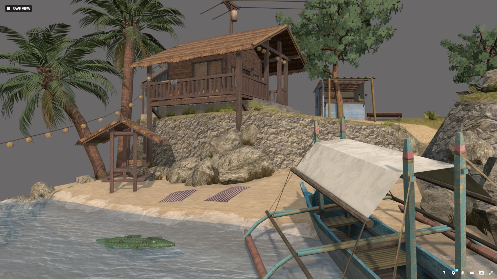
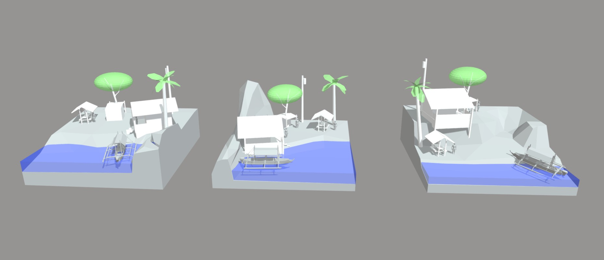
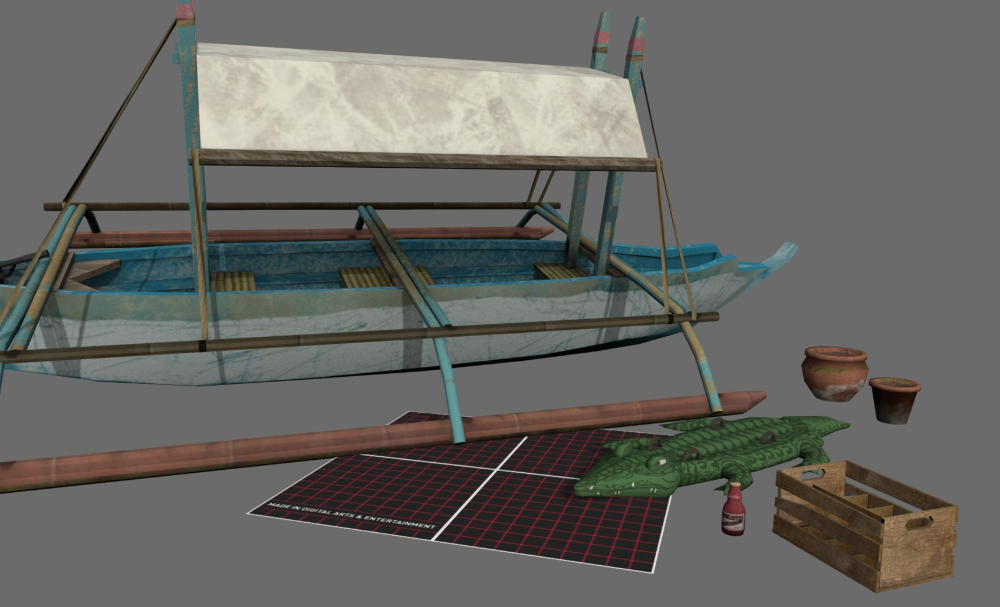

<h1>3D1 Diorama</h1>

This is a diorama I made for the course "3D1" at DAE. We were instructed to make a small scene with a house and a big prop/vehicle of our choice.
The word I choose for the theme was "By The Ocean". I instantly thought of making a scene in my motherland, the Philippines. 
It was a lot of fun finding reference images and making the assets. I also learned a lot about making textures and assets in Blender.

 <iframe title="DAE Diorama - By The Ocean" frameborder="0" allowfullscreen mozallowfullscreen="true" webkitallowfullscreen="true" allow="autoplay; fullscreen; xr-spatial-tracking" xr-spatial-tracking execution-while-out-of-viewport execution-while-not-rendered web-share width="720" height="500" src="https://sketchfab.com/models/f4e6a9e7b9cb4c2db78bf5815009ae5c/embed"> </iframe> 
 <a href="https://sketchfab.com/3d-models/dae-diorama-by-the-ocean-f4e6a9e7b9cb4c2db78bf5815009ae5c?utm_medium=embed&utm_campaign=share-popup&utm_content=f4e6a9e7b9cb4c2db78bf5815009ae5c" target="_blank" rel="nofollow" style="font-weight: bold; color: #1CAAD9;"> DAE Diorama - By The Ocean </a> by <a href="https://sketchfab.com/KenDeDecker?utm_medium=embed&utm_campaign=share-popup&utm_content=f4e6a9e7b9cb4c2db78bf5815009ae5c" target="_blank" rel="nofollow" style="font-weight: bold; color: #1CAAD9;"> KenDeDecker </a> on <a href="https://sketchfab.com?utm_medium=embed&utm_campaign=share-popup&utm_content=f4e6a9e7b9cb4c2db78bf5815009ae5c" target="_blank" rel="nofollow" style="font-weight: bold; color: #1CAAD9;">Sketchfab</a>

---

## Tools Used

**Tool: Blender, Photoshop**

---
## What I Learned

- Working with reference images and using them to create cohesive assets
- Making textures from scratch in Photoshop
- Blocking out multiple scenes and iterating on it

---

