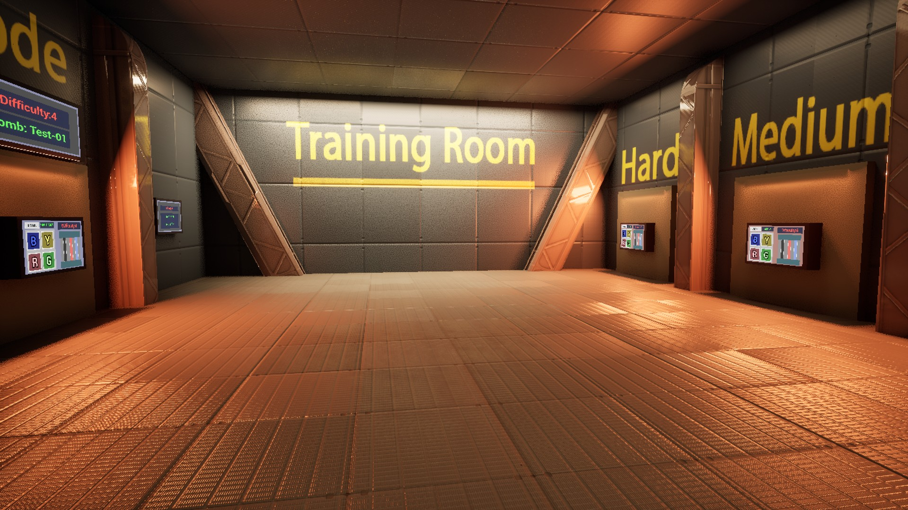
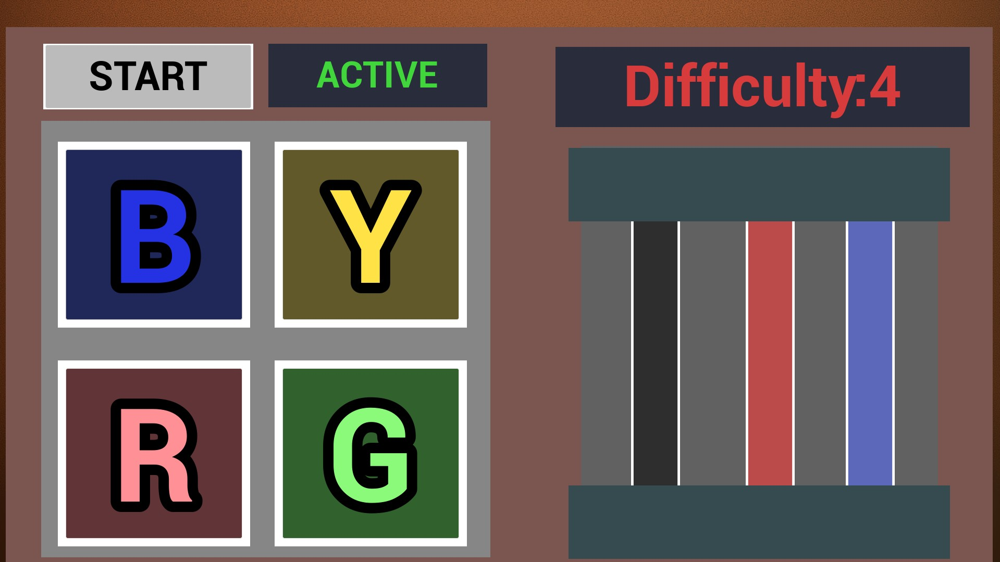
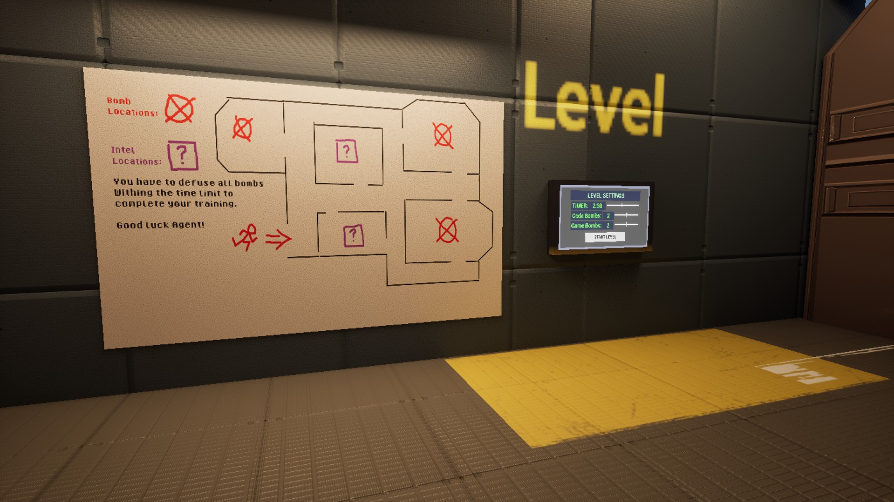
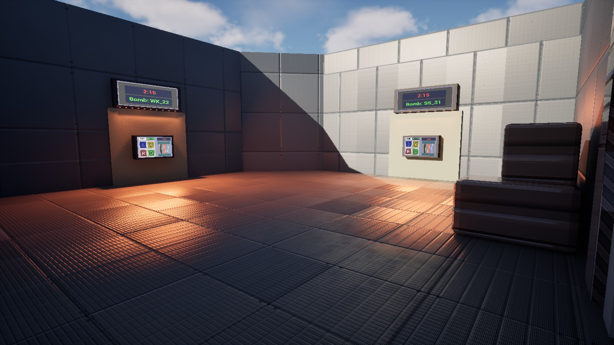

> Find & Cancel is a first-person bomb defusing game. The player has to find active bombs and defuse them all before the time runs out.

For the "Game Engine Fundamentals" course at DAE, I developed a game in Unreal Engine based on two assigned keywords: "FindAndDestroy" and "Cancel".
In the meantime I got this project I was also working on my Environments1 project "Sector42" in Unreal Engine.
It gave me a strong foundational knowledge of the engine and allowed for a smooth transition from environment art to gameplay development.
Drawing on a key lesson in scope management from my previous Unity project ("ShieldArise"), I thought more about downsizing my initial complex concept of a stealth game with patrolling NPCs.
This allowed me to focus on creating an achievable core gameplay loop: a time-sensitive challenge where the player must find and defuse bombs.

<!-- Itch.io link --> 
<a href="https://kennobobo.itch.io/find-cancel" target="_blank" rel="noopener noreferrer" class="icon-link">
    
    Play Find&Cancel on itch.io
</a>

<!-- Embedded Video -->

  <iframe
  src="https://www.youtube-nocookie.com/embed/mI9YJYAaI5M"
  title="Find&Cancel Video" frameborder="0" allow="accelerometer;
  autoplay;
  clipboard-write;
  encrypted-media;
  gyroscope;
  picture-in-picture"
  allowfullscreen></iframe>

---

## Game Mechanics

- **Two unique bombs with different ways to defuse them**

Code bomb: This bomb has to be defused by inputting the correct code. The codes for the bombs can be found on terminals spread around the world.

Minigame bomb: To defuse this bomb the player has to play a game of "Simon Says". A random sequence of buttons will be played and then the player has to corretly input it back.

- **Dynamic difficulty/map**

The positions and amount of bombs placed into the map are modifiable by the player. Letting the players choose how difficult they want the game to be.

---

## Tools and Languages Used

**Tool: Unreal Engine**

**Language: C++**

---
## What I Learned

- Prototyping in Unreal
- Visual scripting by using blueprints

---

