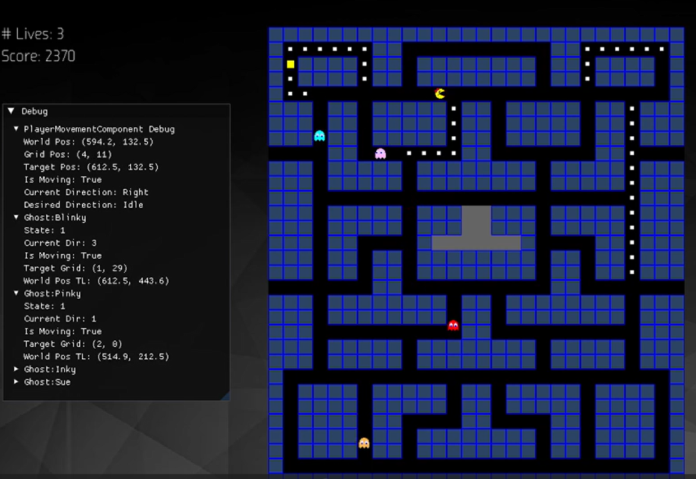
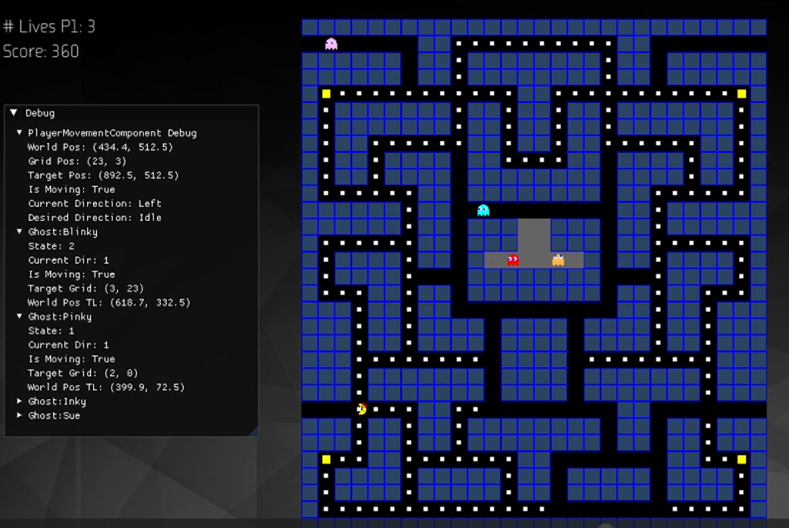
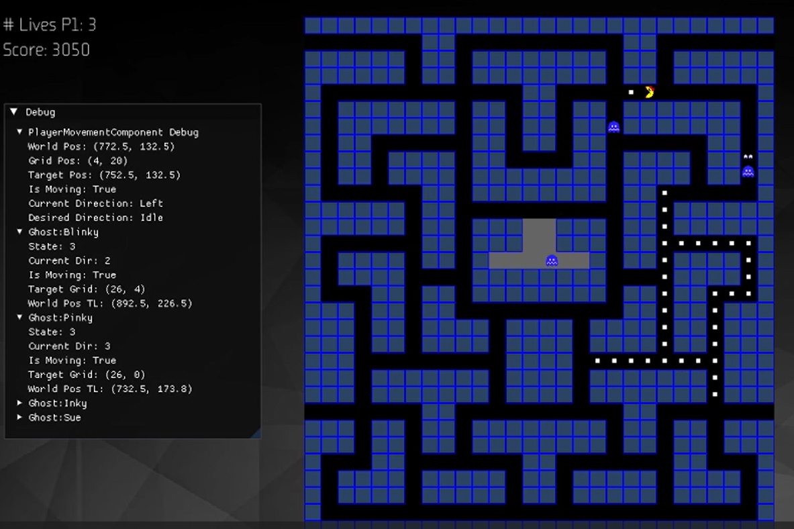

<h1>C++ Game Engine</h1>

In the course "Programming 4" we learned how to make a C++ Game Engine from scratch.
Every week we were taught Key Game Programming & Design Patterns, that we then could implement into our engine.
Our studies of these patterns were guided by the book "Game Programming Patterns" by Robert Nystrom. 
A portion of the course was also dedicated to writing high-quality, correct C++ code.
We were tasked to read "Beautiful C++" by J.Guy Davidson and Kate Gregory to do so, the principles of which we also had to implement into our engine.
To test the usability of our engine, we had to create a game which was randomly assigned to each student.
I got the classic pick of Ms.Pacman and it was my job to implement all the game logic and mechanics using my engine.
It was a challenging but rewarding experience that taught me a lot about engine making and C++ programming.

<!-- Project link --> 
**Project link on Github: (https://github.com/KennoRat/Prog4_EngineExam_MissPacman.git)**
<!-- Book links -->
**Book link "Game Programming Patterns": (https://gameprogrammingpatterns.com)**

**Book link "Beautiful C++": (https://ptgmedia.pearsoncmg.com/images/9780137647842/samplepages/9780137647842_Sample.pdf)**

<!-- Embedded Video -->

  <iframe
  src="https://www.youtube-nocookie.com/embed/K2_WCrUtpi4"
  title="Shield Arise Gameplay Video" frameborder="0" allow="accelerometer;
  autoplay;
  clipboard-write;
  encrypted-media;
  gyroscope;
  picture-in-picture"
  allowfullscreen></iframe>

---

## Engine Core & Design

-  **Component-Based Architecture:** Game logic and data are encapsulated in Components (e.g., RenderComponent, MovementComponent, ColliderComponent) attached to GameObject entities.
-  **SDL2 & Extensions:** Uses SDL2 for windowing, input, and 2D rendering, SDL_image for textures, SDL_ttf for fonts, and SDL_mixer for audio.
-  **Service Locator:** Provides centralized access to global engine services like InputManager and IAudioService.
-  **Threading for Audio:** The SDLMixerAudioService processes sound loading and playback requests on a seperate thread.
-  **PIMPL Idiom:** Applied to key engine classes (e.g., ControllerInput, SDLMixerAudioService) to hide third-party library dependencies (XInput, SDL_mixer) from public headers, reducing compile times and coupling.

---

## Key Game Programming & Design Patterns

-   **Game Loop & Update Method:**
    -   A standard game loop in Minigin::Run manages input, updates, and rendering.
    -   GameObjects delegate Update() calls to their Components, where specific per-frame logic is situated. Delta time is used for consistent behavior.
-   **Command Pattern:**
    -   Decouples input events from actions. InputManager binds keyboard/controller inputs to Command objects (e.g., MoveComman`, UINavigateCommand).
    -   States (like MenuState) dynamically bind and unbind UI-specific commands.
-   **Observer Pattern & Event System:**
    -   Subjects notify Observers of Events (identified by hashed IDs).
    -   Used for game events like Ms. Pac-Man's death/respawn (LivesComponent as Subject, BaseGhostComponent & PlayingState as Observers) and power-up activation (PowerPelletComponent as Subject, BaseGhostComponent as Observer).
-   **Component Pattern:**
    - GameObjects are compositions of BaseComponent derivatives.
-   **State Pattern (Class-Based):**
    -   Manages overall game flow (e.g., MenuState, PlayingState, PausedState).
    -   GameStateMachine controls transitions between GameState implementations. States handle their own specific input, logic, UI, and active scene management. Transitions are signaled via a StateTransition struct.

---

## Game Specifics

-   **Level System:** Levels are loaded from CSV files via LevelGridComponent, which also tracks pellets.
-   **Ms. Pac-Man & Ghosts:** Player and enemy behaviors are implemented using specialized components (PlayerMovementComponent, BaseGhostComponent).
-   **Ghost AI:** Ghosts use a state machine (GhostState) and compositional IGhostChaseBehaviour strategies (e.g., BlinkyChaseBehaviour, PinkyChaseBehaviour) for unique targeting during their Chase state.
-   **Collision Detection:** A CollisionManager checks for overlaps between ColliderComponents, triggering callbacks for game interactions like Ms. Pac-Man dying or eating a frightened ghost.

---

