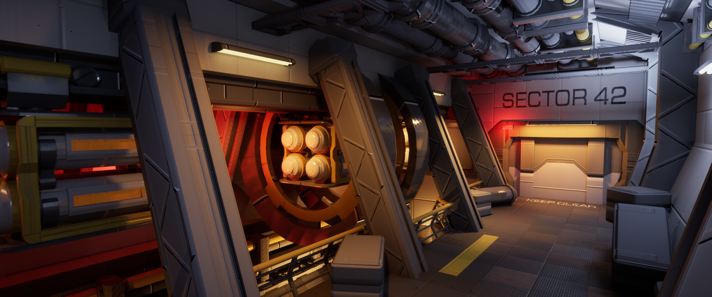
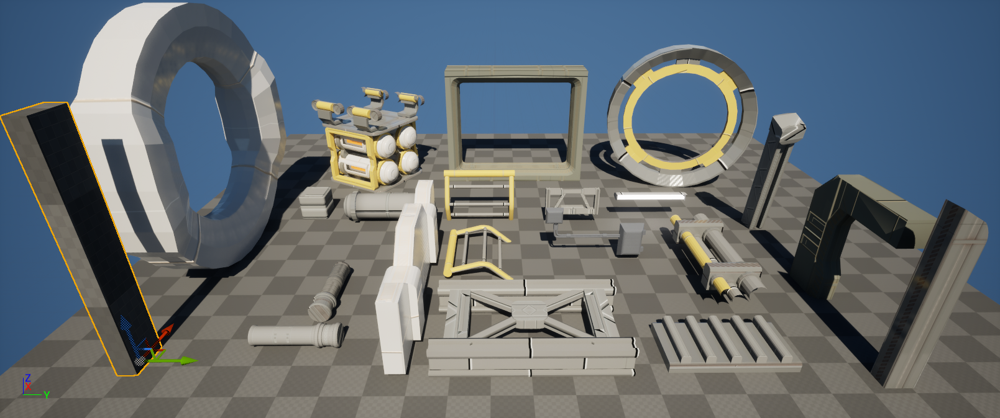
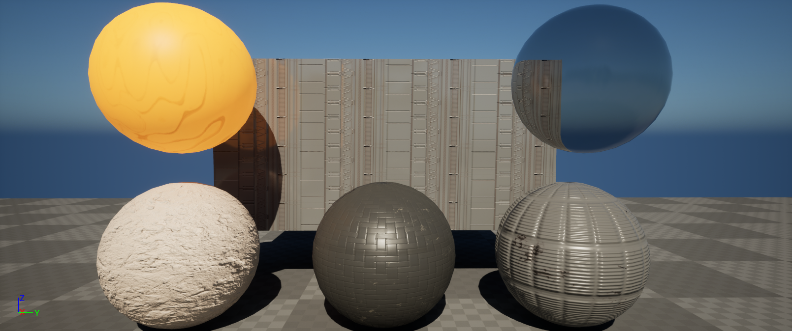

> Sector 42 is an Unreal environments showcase. Made during the course "Environments 1" with some help from fellow students.

We had to make a sci-fi environment using only our own modular assets and textures. As the goal was to work smart and use our time efficiently.
We started out only with a block out and with the combination of feedback and multiple iterations. 
I ended up with Sector 42 as final result. As programmer I feel it was a worthwhile experience to work closely with artists and learn about their workflow.

<!-- Itch.io link --> 
<a href="https://kennobobo.itch.io/sector-42" target="_blank" rel="noopener noreferrer" class="icon-link">
    
    Download Sector42 on itch.io
</a>

<!-- Embedded Video -->

  <iframe
  src="https://www.youtube-nocookie.com/embed/HBx1xYoTmBM"
  title="Sector 42 Video" frameborder="0" allow="accelerometer;
  autoplay;
  clipboard-write;
  encrypted-media;
  gyroscope;
  picture-in-picture"
  allowfullscreen></iframe>

---

## Tools Used

**Tool: Unreal Engine, Blender, Substance 3D painter**

---
## What I Learned

- Making modular and unique assets
- Making textures and normal maps to implement them with trim sheets
- Iterating level designs quickly with block outs using unreal cubegrids
- Communicating with fellow students and giving/receiving feedback
- Handling unreal materials and lighting

---

