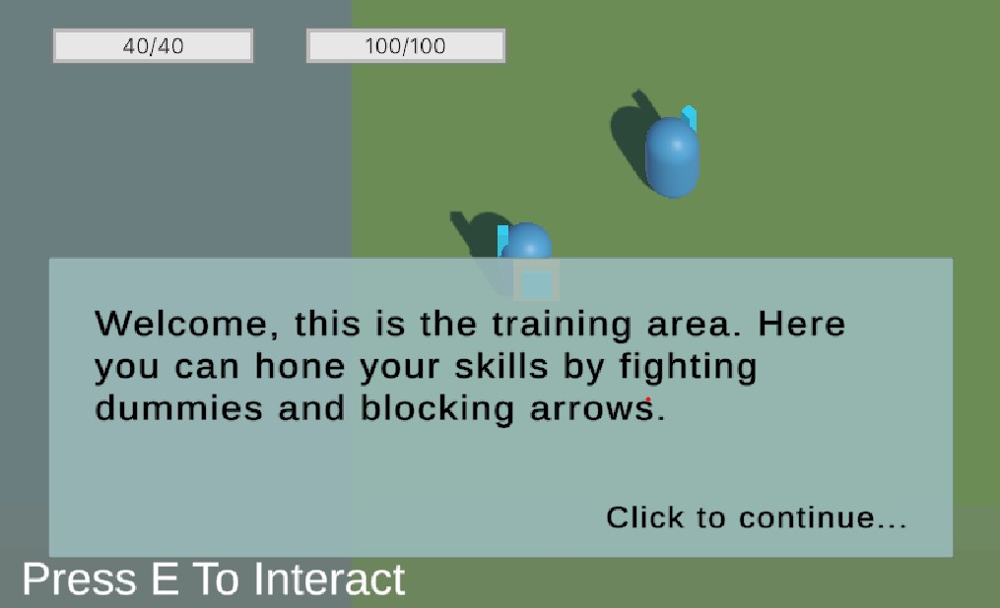
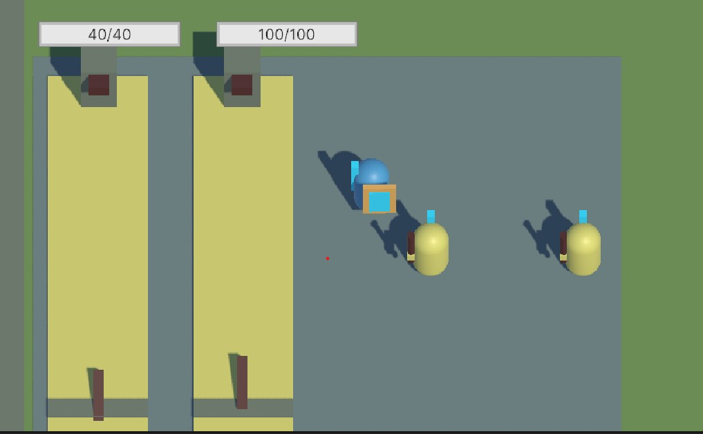
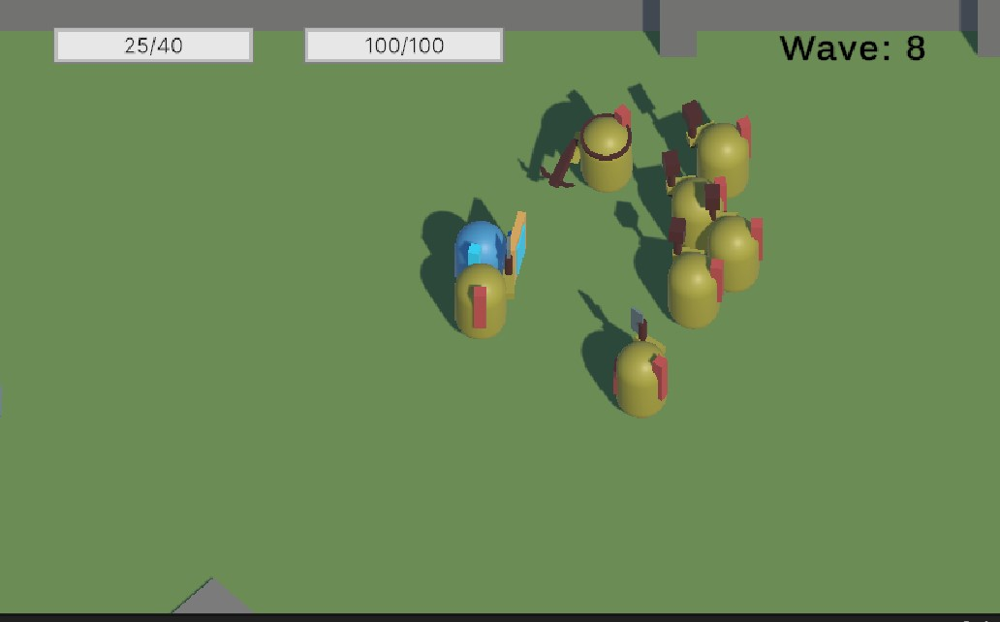

> Shield Arise is a top down action game where you play as a shield bearer. Try to survive as long as you can inside the infinite arena.
> So harness your parrying skills to swiftly defeat your enemies as they are stunned by your power!

The game was made in Unity for the course "game engine fundamentals" at DAE.
We got two keywords to work with and we had to make a game based on those words. Mine were "Shield" and "Arise".
We had full creative control, but before we started we had to got our game proposal accepted.
This had the same creation pipeline as Find&Cancel and it was first game of the two to be made for that course.

<!-- Itch.io link --> 
<a href="https://kennobobo.itch.io/shield-arise" target="_blank" rel="noopener noreferrer" class="icon-link">
    
    Play Shield Arise on itch.io
</a>

<!-- Embedded Video -->

  <iframe
  src="https://www.youtube-nocookie.com/embed/JLpVE-4qzOk"
  title="Shield Arise Gameplay Video" frameborder="0" allow="accelerometer;
  autoplay;
  clipboard-write;
  encrypted-media;
  gyroscope;
  picture-in-picture"
  allowfullscreen></iframe>

---

## Game Mechanics

- Parrying combat

During combat the player can block any attack with their shield. When the player blocks just about when the enemy attack is about to hit they parry them. 
With parrying you can stun enemies with melee attacks and deflect incoming arrows. Stunned enemies can't do anything and are weaker to attacks.

- 3 different types of enemies

Basic melee enemy: They are the most common enemy type you'll fight in the arena. They are weak and slow, but are dangerous in numbers.

Aggressive melee enemy: This enemy type will attack a lot more compared to the basic type. They will try to overwhelm the player with attacks, parrying them is the way to go.

Archer enemy: They will shoot from a distance, but are easily killed. Parry their arrows to use it against themselves.

---

## Tools and Languages Used

**Tool: Unity**

**Language: C#**

---
## What I Learned

- Prototyping in Unity
- Working with C#

---

