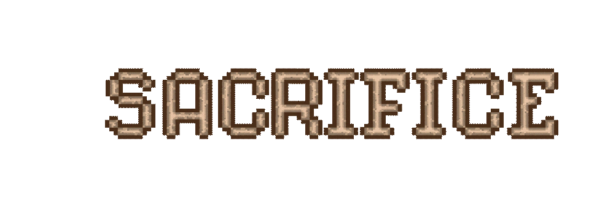
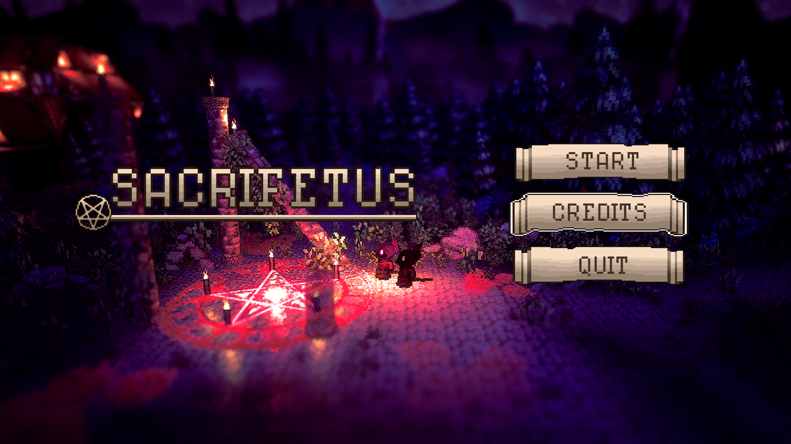
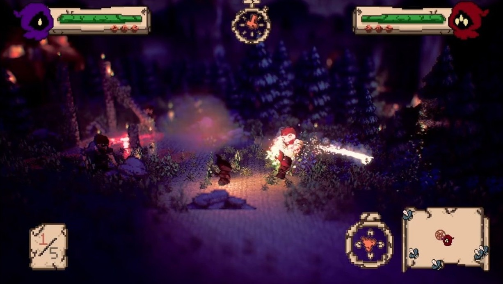
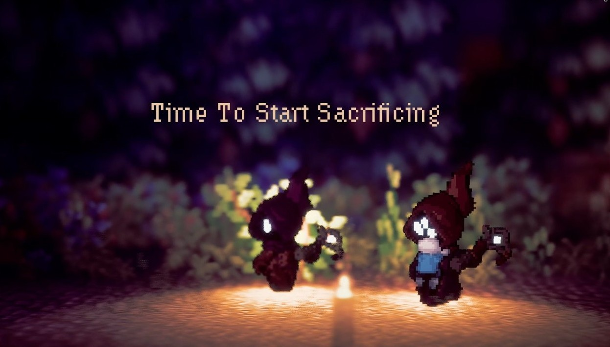

> SacriFetus is a co-op, hack-n-slash game about 2 cultist who want to summon their god by sacrificing babies.

The game was made in Unreal Engine 5 for the course "group projects" at DAE.
We were tasked to work on this game the whole semester, but we were limited to the time we had due to other courses.
Everyone was expected to work 10 hours per week on the game. Leading to a total of about 110 hours per person.
At the end it was a showcase of team effort and we ultimately won 2nd place for art style.

<!-- Itch.io link --> 
<a href="https://britth.itch.io/group19-game-projects" target="_blank" rel="noopener noreferrer" class="icon-link">
    
    Play SacriFetus on itch.io
</a>

<!-- Embedded Video -->

  <iframe
  src="https://www.youtube-nocookie.com/embed/cg3uzhqKGgY"
  title="Sacrifetus Video" frameborder="0" allow="accelerometer;
  autoplay;
  clipboard-write;
  encrypted-media;
  gyroscope;
  picture-in-picture"
  allowfullscreen></iframe>

---

## My Contributions

I was in a team of 5 members working as a programmer mostly tasked with the gameplay and implementing the character sprites.  

- Player movement and Combat.

Player movement changes during gameplay making the combat harder when the player is carrying a baby or their fellow cultist. 
We thought this would make it more tense when the players are trying to escape with a baby while being chased down by enemies.

- Making the Enemy AI using Finite State Machine with states such as Wandering, Patrolling and Seeking.

We wanted to have the enemies be reactive to the players actions. Only making them aggressive when the players start attacking them first or when they kidnap a baby.
This way we wanted to make the world feel more alive and not have the enemies just chase the players around all the time.

- I also implemented the character sprite sheets that the artists have made and set up the logic for playing the correct animations. 

It was a bit tricky at first, but I learned a lot about how to work with sprite sheets in Unreal Engine.
We used a plugin called PaperZD that made our life easier by having a great sprite sheet to characters workflow.

---

## Tools and Languages Used

**Tool: Unreal Engine, Perforce**

**Language: C++**

---
## What I Learned

- Working in a team using Perforce for version control.
- C++ coding in Unreal Engine.
- Handling deadlines and updating our project scope accordingly.
- Keeping track of tasks in a group using hacknplan and having weekly meetings to discuss progress and issues.

---

